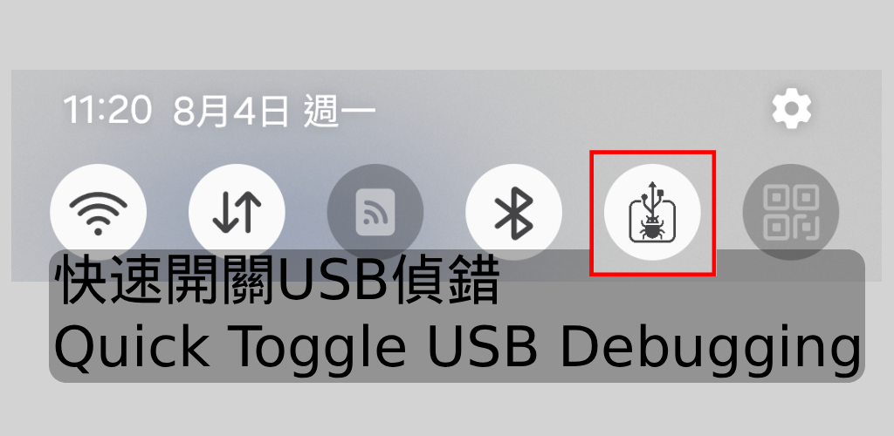

# UsbDebugShortcut - USB Debugging Toggle

🌐 [繁體中文](./README.zh-TW.md) | [简体中文](./README.zh-CN.md)

Have you ever encountered a prompt saying “Please disable USB debugging” while using banking or financial apps?
UsbDebugShortcut is a tool designed to solve this annoying issue. It provides a simple way to quickly turn USB debugging on or off, helping you manually handle these limitations.

## Features
- Quickly toggle USB debugging (requires root access)
- Shortcut available even without root – redirects to Developer Options
- Helps you quickly access settings to manually disable USB debugging
- No ads, no internet required – safe and secure

## Use Cases
- When financial or government apps require USB debugging to be turned off
- Developers or testers who frequently toggle USB debugging
- Save time by avoiding navigating deep into system settings

## Notes
- This app does not collect any personal data; all operations are local to your device.
- One-tap toggle requires root access.
- Non-root devices can still quickly jump to Developer Options to manually adjust settings.
- This app will NOT bypass detection limitations automatically; users still need to manually disable USB debugging.

## Keywords
USB debugging toggle  
disable USB debugging  
bypass USB detection (manually)  
root toggle USB  
Developer Options shortcut  
debug shortcut  
bank app USB warning  
unable to use finance app  
Android root tool  

## Contact
lazyjackdev@gmail.com

## License

This project is licensed under the MIT License. See the [LICENSE](LICENSE) file for details.